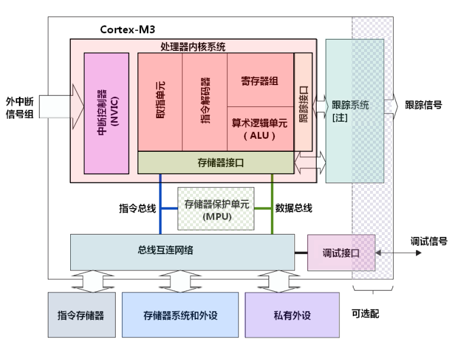
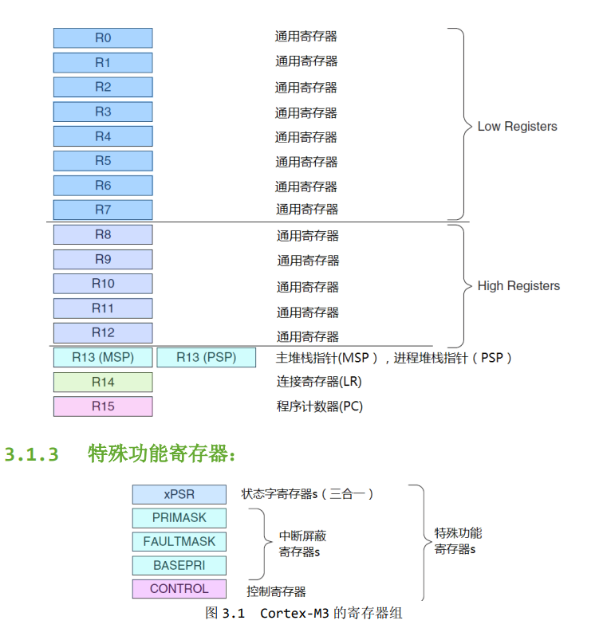
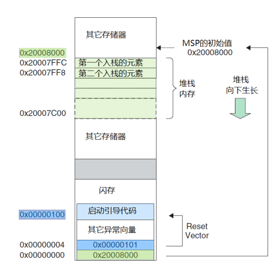

ARM Cortex-M3: ARM芯片架构
32 bit: 一次读取数据的位数4 byte
RISC: CPU指令集
72MHz: 
APB buses
12-bit ADC
I2C
SPI
USART
USB
CAN
向量中断

DPs

就需要从ARM网站下载下面这
些重量级的权威资料：
《The Cortex-M3 Technical Reference Manual》，深入了处理器的内心，编程模型，存储器映射，
还包括了指令时序。
《 The ARMv7-M Architecture Application Level Reference Manual》第2版，对指令集和存储器模型都
提供了最不嫌繁的说明。
其它半导体厂家提供的，基于CM3单片机的数据手册。
如想了解更多总线协议的细节，可以去看《AMBA Specification 2.0》（第 4版），它讲了更多AMBA
接口的内幕。
对于C程序员，可以从《ARM Application Note 179: Cortex-M3 Embedded Software Development》
（第7版）中得到一些编程技巧和提示。
小端模式和大端模式都是支持的。
MPU
MMU

Cortex-M3 CPU 提供称为“调试访问接口(DAP)”的总线接口。通过
这个总线接口，可以访问芯片的寄存器，也可以访问系统存储器，甚至是在内核运行的时候访问！
对此总线接口的使用，是由一个调试端口(DP)设备完成的

CPU 单周期

NMI

# 字节对齐
## 什么是内存对齐？
理论上计算机对于任何变量的访问都可以从任意位置开始，然而实际上系统会对这些变量的存放地址有限制，通常将变量首地址设为某个数N的倍数，这就是内存对齐

## 内存对齐规则？
数据成员对齐规则：struct或者union的数据成员，第一个数据成员放在offset为0的地方，以后每个数据成员都按照#pragma pack数值和这个数据成员自身大小中更小的那个进行对齐。整体对齐规则：struct或者union的首地址按照内部最大数据成员的大小和#pragma pack数值较小的那个N进行对齐，并且结构体的总大小为N的整数倍，如有必要编译器也会在最后一个成员后面填充一些字节用于对齐。

