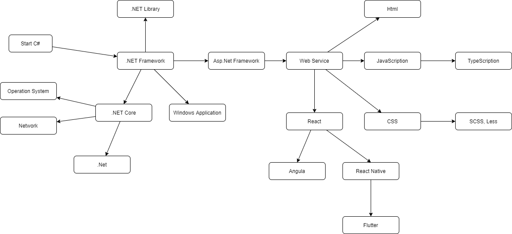
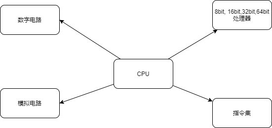
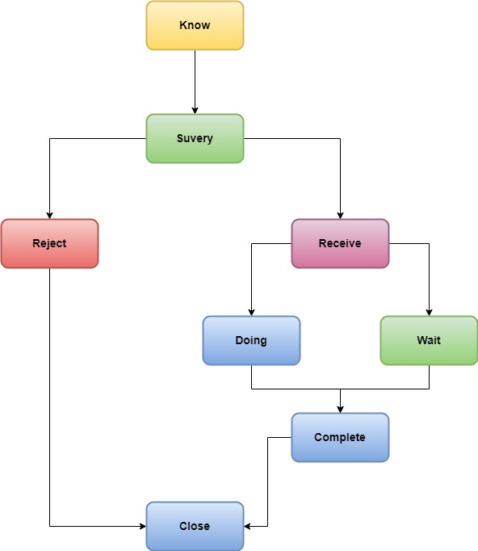

# 内容
+ 知识的学习，总结， 反思。
+ 思想的形成，论证，成立。

# 创造

猜想 --> 论证 --> 理论 --> 形成。

# Knowledge

# Computer Hardware

# WorkFlow

# 应用开发
**需求** -- **分析，拆分** --> **模块** -- **拆分** --> **功能** -- **组合** --> **应用**

# 目录

- [application](./application)
    - [cake-shop](./application/cake-shop)
- [books](./books)
- [computer](./computer)
- [tools](./tools)
- [works](./works)

# 互联网发展报告
+ [2021](https://mp.weixin.qq.com/s/H-Zl9avqjJp_zYBcwwuvEQ?)

# Question
+ 无符号与有符号的区别
+ 浮点数的存储
+ .NET .Configuration(false)
