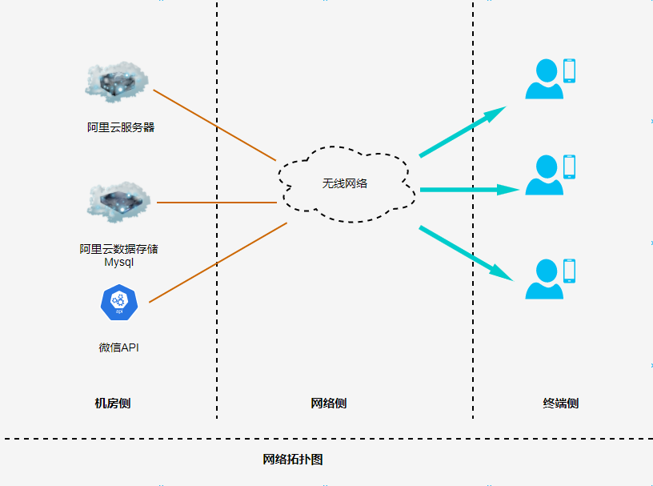
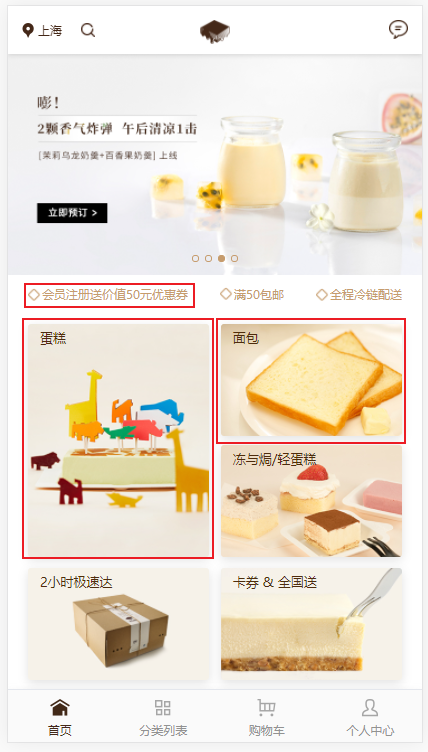
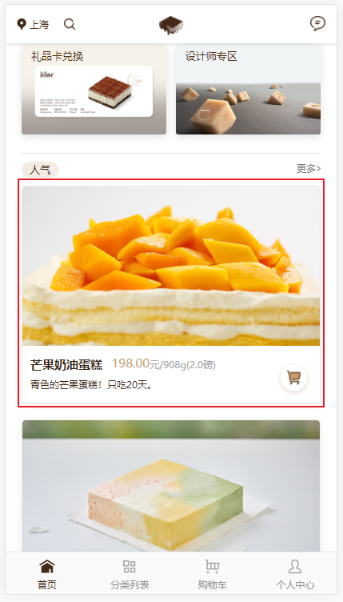
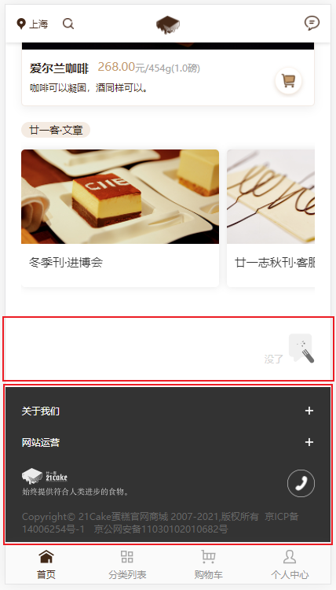
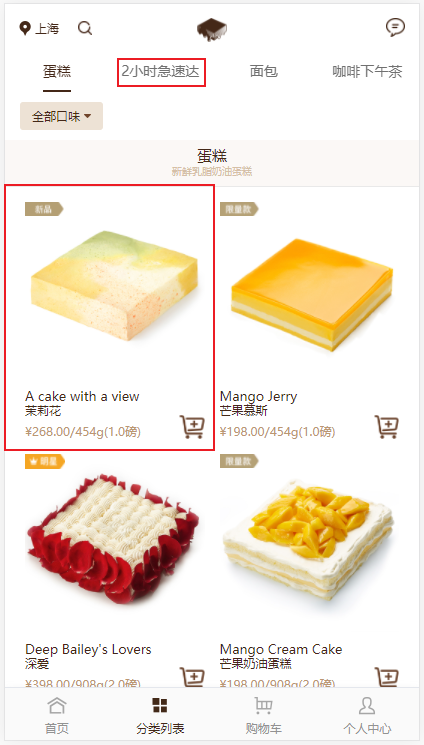
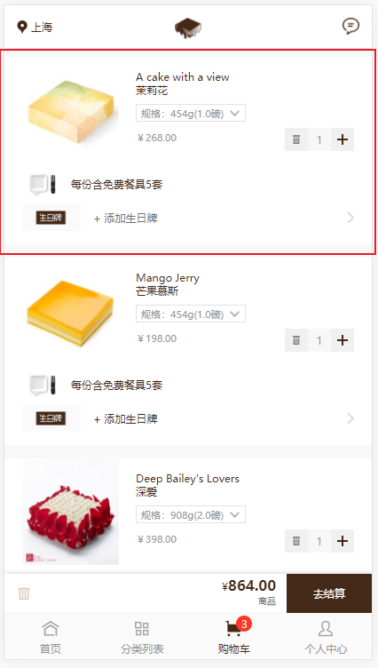
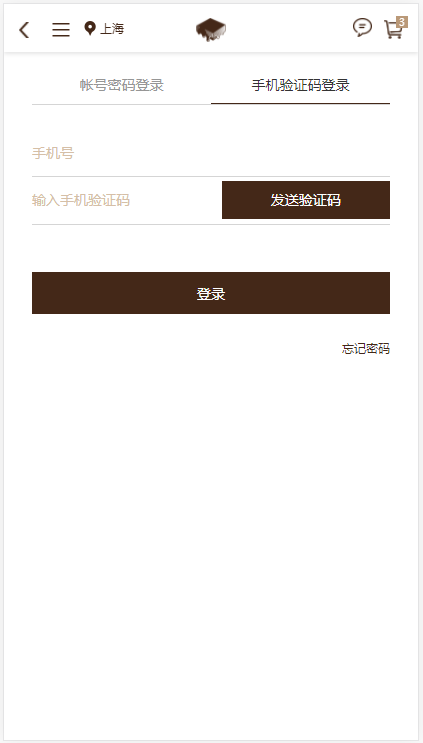
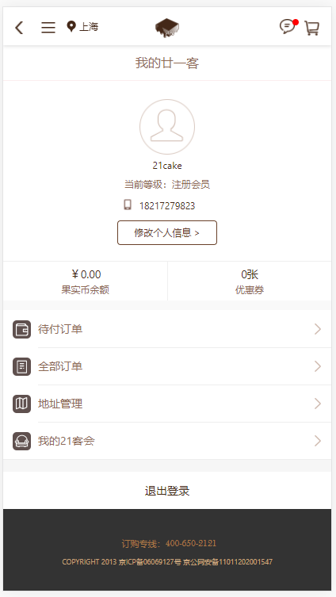

| 项目 | 项目名称 |
| :---  | :--- |
| 文档 | CakeShop软件需求规格说明书 |
| 文档ID | |
| 说明 | V0.1 |
| 作者 | 姚迪迪 |
| 最后更新时间 | |

**版本更新概要**

| 版本号 | 时间 | 更新人 | 更新摘要 |
| :---: | :---: | :---: | :---: |
| V0.1 | 2021-07-13 | 姚迪迪 | 开始编写文档 |

**项目负责人审核与确认**

| 版本号 | 姓名 | 职位 | 审核时间 | 审核意见（签名） |
| :--- | :---: | :---: | :---: | :--- |
| V0.1 |

# 第一章 引言

## 1.1 编写目的

为明确软件需求，安排项目规划与进度，组织软件开发与测试，撰写本文档。

## 1.2 软件需求分析理论

软件需求分析（Software Requirement Analysis）是研究用户需求得到的东西，完全理解用户对软件需求的完整功能，确认软件功能需求，建立可确认的， 可验证的一个基本依据。

软件需求分析是一个项目的开端，也是项目实施最重要的关键点。据有关的机构分析结果表明，设计的软件产品存在不完整性，不确定性等问题80%以上是需求分析错误所导致的，

而且由于需求分析错误造成根本性的功能问题尤为突出。因此，**一个项目的成功，软件需求分析是关键一步**。

## 1.3 软件需求分析目标

**软件需求分析的主要实现目标**

1. 对实现软件的功能性做全面的描述，帮助用户判断实现功能的正确性，一致性和完整性，促使用户在软件启动之前周密地，全面地思考软件需求。

2. 了解和描述软件实现所需要的全部信息，为软件设计，确认和验证提供一个基准。

3. 为软件管理人员进行**软件成本计划**和**编制软件开发计划书**提供依据。

需求分析的具体内容可以归纳为六个方面：

+ 软件的功能需求
+ 软件和硬件或其他外部接口
+ 软件的非功能性需求
+ 软件的反向需求
+ 软件设计与实现上的限制
+ 阅读支持信息

## 1.4 参考资源

**文档参考**
1. 《软件工程基础》赵一定 北京邮电大学出版社
2. 《软件需求》劳森（作者），刘晓晖（译者） 电子工业出版社
3. 《软件需求工程：原理和方法》 金芝， 金英 科学出版社

**应用参考**

1. 21Cake: https://wx.21cake.com/?__UTM=wx_button

# 第二章 需求概述

## 2.1 项目背景

目前，蛋糕的售卖主要通过微信群，向用户发放图片推广蛋糕，当了解到有沟通意向的用户，再进行私下沟通，
通过增加蛋糕线上购物，增加蛋糕销售渠道，从而增加销售额，以及品牌的知名度。

## 2.2 需求概述

本产品主要为蛋糕销售增加线上销售功能。

## 2.3 条件与限制

+ 需要客户提供微信公众号，作为CakeShopWeb的入口。

## 2.4 系统结构

1. 终端用户层：手机，平板，为用户提供展示。

2. 运营商服务层：
    - 微信： 提供微信公共号，以及支付接口
    - 阿里云： 阿里云服务器，阿里云mysql

3. 业务逻辑层：系统核心业务处理，主要支撑系统业务处理，移动端的数据请求处理。

## 2.5 网络拓扑图

网络拓扑划分层次描述：

+ 终端侧: 发起网络请求的终端设备和软件。
+ 网络侧： 运营商的网络。
+ 机房侧： 部署系统的服务器。

# 第三章 系统功能需求

## 3.1 登录模块

1. 账号登录。
2. 账号注册。

## 3.1 商品选购模块

1. 商品加入购物车
2. 商品移除购物车

## 3.2 购物模块

1. 下单
2. 支付

# 第四章 API

# 第五章 技术选型

前后端分离

**前端**:

+ UmiJS
+ React
+ Bootstrap

**后端**：

+ AspNetCore Web Api

**服务器**:

+ 阿里云服务器

**数据存储**:

+ 阿里云Mysql

# 第六章 软硬件需求

## 1. 用户界面

## 1.1 主页面

## 1.2 产品分类列表

## 1.3 购物车

## 1.4 用户中心

