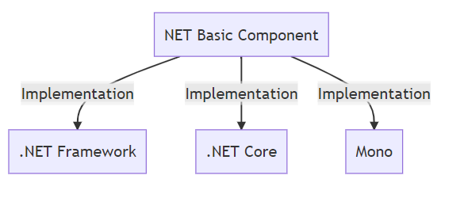

# Worthy Blog

+ Exploring the generic host: https://andrewlock.net/exploring-the-new-project-file-program-and-the-generic-host-in-asp-net-core-3/

# Planning
1. Read the official .Net documentation.
2. Read source code of The EF Core.

# NET
.NET is a general purpose development platform. It has several key features, such as support for multiple programming languages, asynchronous and concurrent programming models, and native interoperability, which enable a wide range of scenarios across multiple platforms.
# CSharp
+ C# -> IL
https://sharplab.io/#b:master/f:%3Eilr/K4Zwlgdg5gBAygTxAFwKYFsDcAoADsAIwBswBjGUogQxBBgGEYBvbGNmAge06JgFkAjAApOBAFapSyGAA8AlDAC8APlkwwdCMCJEcASC49+AJhHjJ0+UtUylimFp04AvkA==
+ Online net source code browser
  - NET Core: https://source.dot.net/
  - NET Framework: https://referencesource.microsoft.com/

## .NET Architectural Components

+ .NET Basic Compoent - Mermaid Diagram Online Edit

+ .NET Implementations - Mermaid Diagram Online Edit

