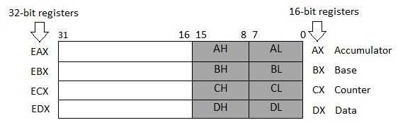

# Assembly language

# Memory Segments
A segmented memory model divides the system memory into groups of independent segments

referenced by pointers located in the segment registers.Each segment is used to contain a specific
type of data.

One segment is used to contain instruction codes, another segment stores the data elements, and a
third segment keeps the program stack.

+ Data segment: It is represented by `.data` section and the `.bss`. The .data section is used to declare the memory
region, where data elements are stored for the program. This section cannot be expanded after the data elements are declared.
and it remains static throughout the program.

The `.bas` section is also a static memory section that contain buffers for data to be declared later in the program. This buffer memory is zero-filled.

+ Code segment: It is represented by `.text` section. This defines an area in memory that stores the instruction codes. This is also a fixed area. 

+ Stack segment: This segment contains data values passed to functions and procedures within the program.

# Processor Registers
There are ten 32-bit and six 16-bit processor register in IA-32 architecture. The registers are grouped into three categories
+ General registers
    + Data registers
    + Pointer registers
    + Index registers
+ Control registers
+ Segment registers

## Data Registers
Four 32-bit data registers are used for arithmetic, logical, and other operations.
These 32-bit registers can be used in three ways
+ As complete 32-bit data registers: EAX, EBX, ECX, EDX
+ Lower halves of the 32-bit registers can be used as four 16-bit data registers: AX, BX, CX and DX
+ Lower and higher halves of the above-mentioned four 16-bit registers can be used as eight 8-bit data register: 
AH, AL, BH, BL, CH, CL, DH, and DL.

AX is the primary accumlator: it is used in input/output and most arithmetic instructions, For example, in multiplication operation, one operand is stored in EAX or AX or AL register accoriding to the size of the operand.

BX is known as the base register, as it could be used in indexed addressing.

CX is known as the count register, as the ECX, CX registers store the loop count in iterative operations.

DX is know as the data regsiter. It is also used in input/output operations. It is also used with AX register along with DX for multiply and divide operations involving large values.

## Pointer Registers
The pointer registers are 32-bit EIP, ESP, and EBP register and corresponding 16-bit right potions IP, SP, and BP. There are three categories of pointer registers

+ Instruction Point(IP) - The 16-bit IP register stores the offset address of the next instruction to be executed. 
IP in association with the CS register(as CS:IP)gives the complete address of the current instruction in the code segment.

+ Stack Pointer(SP) - The 16-bit SP register provides the offset value within the program stack. SP in association with the SS register(SS:SP) refers to be current position of data or address within the program stack.

+ Base Pointer(BP) - The 16-bit BP register mainly helps in referencing the paramter variables passed to a subroutine. 
The address in SS register is combined with the offset in BP to get teh location of the parameter. BP can also be combined
with DI and SI as base register for special addressing.

## Index Registers
The 32-bit index registers, ESI and EDI, and their 16-bit rightmost portions. SI and DI, are used for indexed addressing and sometimes used in addition and subtraction. There are two sets of index pointers −

+ Source Index (SI) − It is used as source index for string operations.

+ Destination Index (DI) − It is used as destination index for string operations.

## Control Registers
Many instructions involve comparisons and mathematical calculations and change the status of the flags and some other conditional instructions test the value of these status flags to take the control flow to other location.

## Segment Registers

+ Code Segment − It contains all the instructions to be executed. A 16-bit Code Segment register or CS register stores the starting address of the code segment.

+ Data Segment − It contains data, constants and work areas. A 16-bit Data Segment register or DS register stores the starting address of the data segment.

+ Stack Segment − It contains data and return addresses of procedures or subroutines. It is implemented as a 'stack' data structure. The Stack Segment register or SS register stores the starting address of the stack.