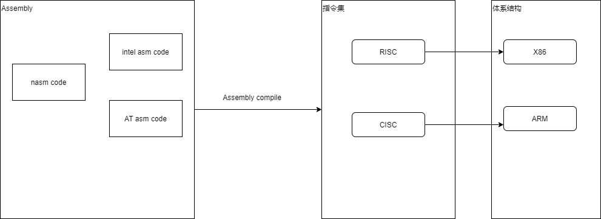

# Overview

**目标**: 把含有自制的操作系统的CR-ROM或软盘插入电脑，只要打开电源开关就能自动运行。

**步骤**: 在Windows系统上编写源代表 --> 同C语言编译器编译代码，生产机器语言文件 --> 对机器语言文件进行加工，生产软盘映像文件 --> 将硬件文件写入磁盘，作出含操作系统的启动盘

**内容构成:**
+ CPU基本知识
+ 汇编
+ C语言

## CPU
一个CPU的体系结构有一个指令集加上一些寄存器而组成



## Environment and Tools
+ Windows 64bit
+ Ubuntu
    + Use [wsl](https://docs.microsoft.com/en-us/windows/wsl/install) install it on windows
    + [QEMU](https://www.qemu.org/): A generic and open source machine emulator and virtualizer
        - sudo apt-get install qemu-system: The command will install all system. Includes i386, x86_64, arm and so on.
+ vscode: [windows platform](https://code.visualstudio.com/download)
+ [nams](https://en.wikipedia.org/wiki/Netwide_Assembler) on Ubuntu
    ```bash
    sudo apt update
    sudo apt install nasm
    ```
+ make on Ubuntu
    ```bash
    sudo apt update
    sudo apt install make
    ```

## How to debug assembly?
Take qemu-system-i386 as example?
1. Compile assembly code to img file.
2. Runing `qemu-system-i386 -fda ./hello-os.img -s -S`. This command make os started waiting respone from the gdb.
3. Runing `target remote localhost:1234` in the gdb.
4. Make breakpoint and execute contionue.
    ```txt
    (gdb) br *0x7c00
    Breakpoint 1 at 0x7c00
    (gdb) c
    Continuing.

    Breakpoint 1, 0x00007c00 in ?? ()
    (gdb) x/i $eip
    => 0x7c00:      jmp    0x7c3e
    ```
## 计算机启动流程
1. 通电，CPU寻址到CS:IP指向的地址(BIOS的地址)
2. 读取ROM里面的BIOS, 检查硬件。
3. 硬件检查通过。
4. BIOS根据指定的顺序，检查引导设备的第一个扇区（即主引导记录，自动加载第一个扇区并且加载到内存地址0x7c00.
5. 主引导记录把操作权交给操作系统。

**参考文档**
* 计算机是如何启动的？: https://www.ruanyifeng.com/blog/2013/02/booting.html
* 主引导地址为什么ox7C00: http://www.ruanyifeng.com/blog/2015/09/0x7c00.html


## CPU
CPU 优先读写寄存器，再由寄存器跟内存交换数据。

寄存器不依靠地址区分数据，而依靠名称。每一个寄存器都有自己的名称，我们告诉 CPU 去具体的哪一个寄存器拿数据，这样的速度是最快的

## 16bit 寄存器
+ AX: accumulator,累加寄存器
    + AH
    + AL
+ CX: count, 计数寄存器
    + CH
    + CL
+ DX: data,数据寄存器
    + DH
    + DL
+ BX: base, 基址寄存器
    + BH
    + BL
+ SP: stack pointer, 栈指针寄存器
+ BP: base pointer, 基址指针寄存器
+ SI: source index, 源变址寄存器
+ DI: destination index, 目的变址寄存器

32bit EAX, ECX, EDX, EBX, ESP, EBP, ESI, EDI

**段寄存器**
+  ES

## 内存模型
Stack, Heap

# Embedded assembly in C

using [GCC](http://www.ibiblio.org/gferg/ldp/GCC-Inline-Assembly-HOWTO.html)
```c
__asm__(
    "movl %edx, %eax\n\t"
    "addl $2, "%eax\n\t"
);
``` 
using VC++
```c
__asm {
    mov eax, edx
    add eax, 2
}
```
