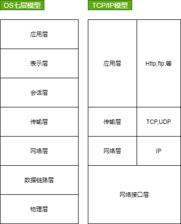

# Network

是由一些位于网络节点上提供共享资源的计算机组成的。

## NetWork模型

## 网络硬件

+ 路由器
+ 交换机(接入广域网internet)
+ 网桥
+ 网关
+ 网络协议(TCP/IP协议)
+ 网卡(计算机通过网卡接入局域网络)

# IP

在Internet上，每一个节点都依靠的IP地址互相区分和相互联系。IP地址是一个32位二进制数的地址,由4个8位字段组成，每个字段之间用点号隔开,用于标识TCP/IP宿主机。

每个IP地址都包含两部分:**网络ID**和**主机ID**。网络ID标识在同一个物理网络上的所有宿主机，主机ID标识该物理网络上的每一个宿主机，于是整个Internet上的每个计算机都依靠各自的IP地址来标识。

**例如**

每一台联网的计算机无权自行设定IP地址，有一个统一的机构-IANA负责对申请的组织分配网络ID,而该组织可以对自己的网络中的每一个主机分配一个主机ID，正如一个单位无权决定自己在所属城市的街道名称和门牌号，但可以自主决定本单位内部的各个办公室编号一样。

## MAC地址与IP地址的区别

https://zhuanlan.zhihu.com/p/74432070

**区别**

1. 对于网络中的一些设备，路由器或者是PC及而言，IP地址的设计是出于拓扑设计出来的，只要在不重复IP地址的情况下，它是可以随意更改的；而MAC地址是根据生产厂商烧录好的，它一般不能改动的，一般来说，当一台PC机的网卡坏了之后，更换了网卡之后MAC地址就会变了。

2. 在前面的介绍里面，它们最明显的区别就是长度不同，IP地址的长度为32位，而MAC地址为48位。

3. 它们的寻址协议层不同。**IP地址应用于OSI模型的网络层，而MAC地址应用在OSI模型的数据链路层。 数据链路层协议可以使数据从一个节点传递到相同链路的另一个节点上（通过MAC地址），而网络层协议使数据可以从一个网络传递到另一个网络上**（ARP根据目的IP地址，找到中间节点的MAC地址，通过中间节点传送，从而最终到达目的网络）。

4. 分配依据不同。IP地址的分配是基于我们自身定义的网络拓扑，MAC地址的分配是基于制造商。一个是主观的，而另一种是可观的

# 组成

- 网络
- 计算机网络
    - 网络操作系统
    - 网络管理软件
    - 网络通信协议

# 资源
+ [掘金 关于 TCP/IP，必知必会的十个问题](https://juejin.cn/post/6844903490595061767)
+ [视频教程 哈尔滨工业大学-计算机网络](https://www.bilibili.com/video/av10101468/)
