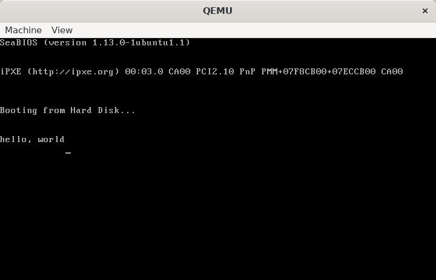

# Requirement
+ Install vscode extension Hex Editor

# Start img steps

1. use command ["dd if=/dev/zero of=helloos.img count=1474560 bs=1"](https://www.runoob.com/linux/linux-comm-dd.html) to create img. Exeute above cmdle in gitbash.(Its execute very slowly in bash shell in Ubuntu)

2. Open file use vs code with [Hex Editor](https://marketplace.visualstudio.com/items?itemName=ms-vscode.hexeditor) extension. Then edit follow the sample of the book.

3. Run qemu-system-i386 helloos.img in bash shell. Executed result as following.

