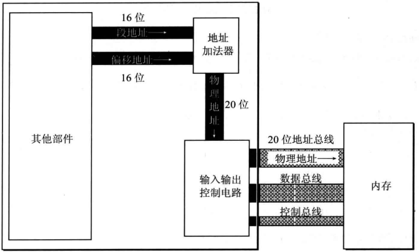

# 寄存器
典型的CPU由运算器，控制器，寄存器等器件构成。

程序员通过控制寄存器来实现对CPU控制。

以8086CPU为例，有14个寄存器，每个寄存器有对应的名称。
+ AX: 通用寄存器，存放数据，可分为AH, AL
+ BX: 通用寄存器，存放数据，可分为BH, BL
+ CX: 通用寄存器，存放数据，可分为CH, CL
+ DX: 通用寄存器，存放数据，可分为DH, DL
+ SI
+ DI
+ SP
+ BP
+ IP
+ CS
+ SS
+ DS
+ ES
+ PSW

其中
+ CS:IP: 确定CPU执行指令的地址
+ SS:SP：确定stack的栈顶地址
+ DS: 确定读取的内存地址[1] = DS:0x01

## 检查点2.1
+ 写出每条汇编指令执行后相关寄存器的值
mov ax, 62627   ax = F4A3H
mov ah, 31H     ax = 31A3H
mov al, 23H     ax = 3123H
add ax, ax      ax = 6246H
mov bx, 826CH   bx = 826CH
mov cx, ax      cx = 6246H
mov ax, bx      ax = 826CH
........

+ 最多使用4条指令，计算2的4次方
mov ax, 2   ; 2
add ax, ax  ; 4
add ax, ax  ; 8
add ax, ax  ; 16

## 2.4 物理地址
8086CPU内部利用加法器将两个16位地址合成一个20位的物理地址。

加法器公式: 物理地址 = 段地址 x 16 + 偏移地址

## 检测点2.2
1. 给定段地址位0001H，仅通过改变偏移地址寻址，CPU的寻址范围位00010H到1000FH.
2. 有以数据存放在内存20000H单元，先给定段地址SA，若想有偏移地址寻到此单元。则SA应满足的条件：最小1001H，最大2000H

## 2.9 段寄存器
段寄存器提供段地址

8086CPU有4个段寄存器：CS，DS，SS，ES

## 2.10 CS和IP
CS和IP指示CPU当前要读取指令的地址。CS位代码段寄存器，IP为指令指针寄存器。
8086CPU任意时刻都是从CS x 16 + IP的地址读取指令并执行。

CPU读取一条指令后IP自动增长。

在8086CPU加电启动或复位后，CS和IP被设置位CS=FFFFH， IP=0000H，所以8086PC刚启动时，CPU从FFFF0单元读取指令执行。

CPU如何区分二进制为指令还是数据。CS:IP指向的内存单元为指令。

## 2.11 修改CS，IP的指令
程序员可以通过修改CS，IP的内容来控制CPU执行指令。

不能通过mov指令来修改CS，IP。因为CPU没有提供对应的功能，要修改CS，IP必须使用转移指令，常用的是jmp指令。

## 2.12代码段
将内存当作代码段，仅仅是我们在编程时的一种安排，CPU并不会由于这种安排，就自动地将我们定义的代码段中的指令当作指令来执行。

CPU只人被CS：IP指向的内存单元中的内容为指令。

## 2.3
下面的3条指令执行后，CPU几次修改IP？都是在什么时候？最后IP中的值时多少？
mov ax, bx  ; IP + 3
sub ax, ax  ; IP + 3
jmp ax      ; IP + ax