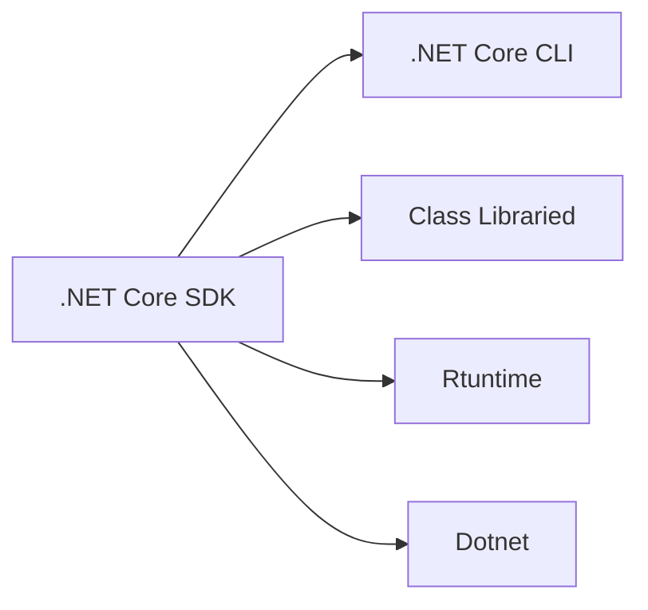

## .NET Core SDK overview
The .NET Core SDK is a set of libraries and tools that allow developers to create .NET Core applications and libraries. It contains the following components that are used to build and run applications.

### Components

