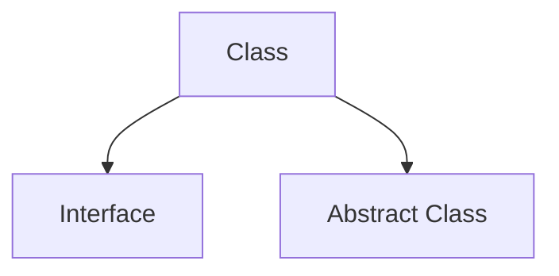

## Think about how to construct a class

## Interface
Interface defines the interface exposed by the class. (接口定义了类暴露功能)

## Abstract Class
It define basic elements that the class must implement.(定义类必须实现的的基础元素)
