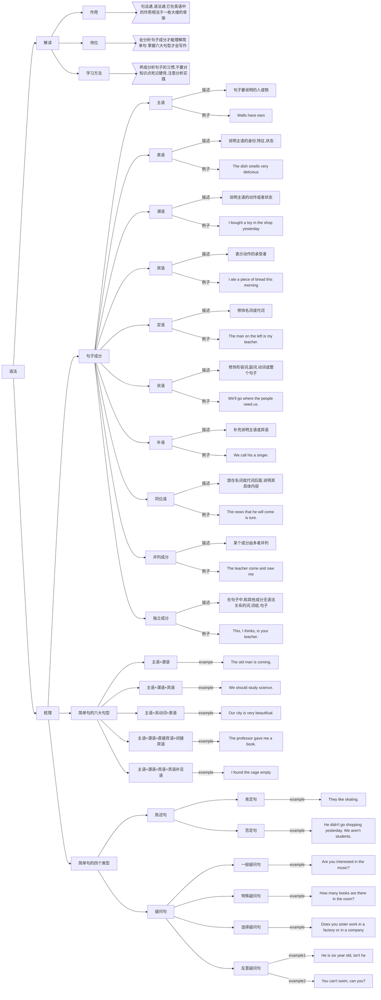

## [英语语法(English grammar)](https://baijiahao.baidu.com/s?id=1652584857673371901&wfr=spider&for=pc)
+ 语法是有框架的，有逻辑可循的。例如一颗树，树干就是语法的框架，框架构建好，树叶就是里面的单词
+ 语法框架公式：__英语句子=主干+修饰成分+时态__
+ 一个句子一般由两部分组成，即主语部分(subject group)和谓语部分(predicate group), 主语一般由名词或动名词构成，谓语部分一般由动词构成
+ 句子的组成部分，包括：主语，谓语，宾语， 补语，表语，同位语共八种。一个句子未必有主语和宾语，但一定有谓语。
+ 主干: 状语+主语+状语+谓语+宾语+宾语+状语
  - At home my mother oftenasks me to review mylessons when I watch TV.

## 句法
+ [Diagram Mermaid Online Edit]

+ [Diagram View]

+ Diagram Mermaid Code

