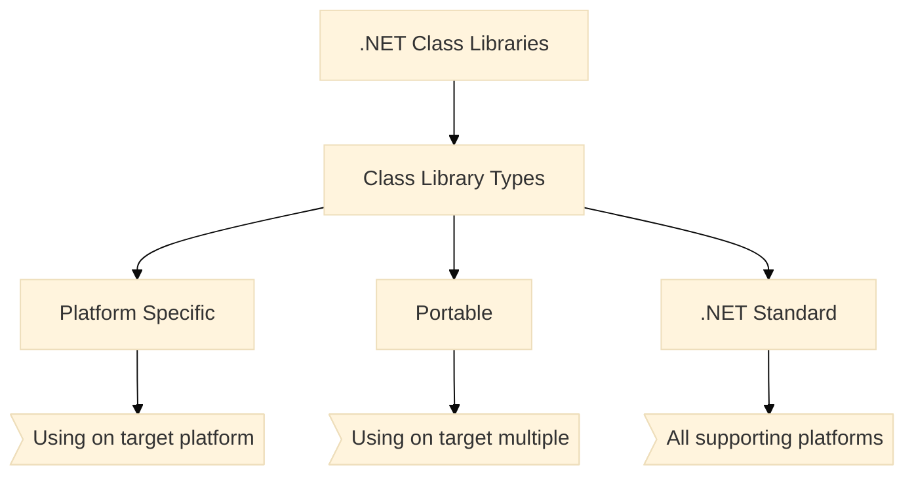

# Overview
Class libraries are the shared library concept for .NET. They enable you to componentize useful functionality into modules that can be used by multiple applications. They can also be used as a means of loading functionality that is not needed or not known at application startup. Class libraries are described using the .NET Assembly file format.

## Components
+ [Mermaid Diagram Online Edit]

+ [Mermaid Diagram View]

+ Mermaid Diagram Code

