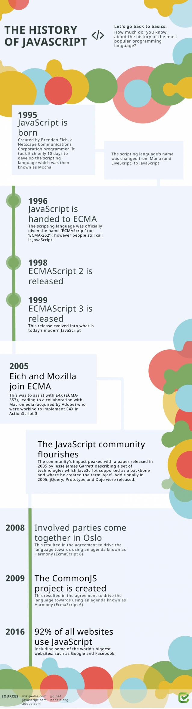

# About JS

JavaScript is a lightweight, **interpreted**, object-oriented language with [first-class function](https://en.wikipedia.org/wiki/First-class_function),
and is best known as the scripting language for Web Pages, but it's [used in many non-browser environments](https://en.wikipedia.org/wiki/ JavaScript#Uses_outside_Web_pages) as well. It is a [prototype-based](https://en.wikipedia.org/wiki/Prototype-based_programming), multi-paradigm scripting language that is dynamic, and support object-oriented, imperative, and functional program style.

JavaScript can function as both a procedural and an object oriented language. Objects are created programmatically in JavaScript, by attaching methods and properties to otherwise empty objects at run time. as opposed to the syntactic class definition common language like C++ and Java. Once an object has been constructed it can be used as blueprint(prototype) for creating similar objects.

## History



## Runtime platform

+ Web Browser: [V8 engine](https://v8.dev/)
+ Server: [NodeJS](https://nodejs.org/en/)

## Tutorials
https://javascript.info/

## ES6
https://es6.ruanyifeng.com/#docs/destructuring

## Data types(Eight)

### Seven primitives

1. String: A sequence of characters that represent a text value. For example: "Hello".
2. Number: An integer or floating point number. For example: 45 or 3.14159.
3. Boolean: true and false. 
4. BigInt: An integer with arbitrary precision. For example: 9007199254740992n.
5. null: A special keyword denoting a null value. (Because JavaScript is case-sensitive, null is not the same as Null, NULL, or any other variant.).
6. undefined: A top-level property whose value is not defined.
7. Symbol (new in ECMAScript 2015). A data type whose instances are unique and immutable.

## Stream

NodeJs中异步方式的同步编程方案，通过回调函数和事件。

## Promise

**为什么需要Promise**

同步一系列异步方法。

**什么是Promise**

Promise是在NodeJs中异步方式的同步编程方案，传统的异步解决方案是通过回调函数和事件。

**Promise原理**

Promise像是一个容器，容器里存放着某个未来才会结束的事件。可以从容器里获取事件的状态。

**Promise有三种状态**

+ pending(进行中)
+ fulfilled(已成功)
+ rejected(已失败)

转换方向，状态不可逆

+ pending ---> fulfilled
+ pending ---> rejected

**Promise缺点**

1. 无法取消Promise，一旦新建它就会立即执行，无法中途取消。
2. Promise内部抛出的错误，不会反应到外部。只能通过.catch捕获，exception具有冒泡性质。
3. 当处于pending状态时，无法得知目前进展到哪一个阶段（刚刚开始还是即将完成）。

**Promise Exception**

Promise内部抛出的错误，不会反应到外部。只能通过.catch捕获，exception具有冒泡性质。

Node.js 有一个`unhandledRejection`事件，专门监听未捕获的reject错误

```js
///unhandledRejection事件的监听函数有两个参数，第一个是错误对象，第二个是报错的 Promise 实例，它可以用来了解发生错误的环境信息。
process.on('unhandledRejection', function (err, p) {
  throw err;
});
```

**注意，Node 有计划在未来废除unhandledRejection事件。如果 Promise 内部有未捕获的错误，会直接终止进程，并且进程的退出码不为 0。**

**example**

```js
// Simple

const promise = new Promise(function(resolve, reject) {
    let flag = false;
    if (flag) {
        return resolve("fulfilled");
    } 

    return reject("reject");
})

promise.then(result => console.log(result)).catch(error => console.log(error));

```

```js
const p1 = new Promise(function (resolve, reject) {
  setTimeout(() => reject(new Error('fail')), 3000)
})

const p2 = new Promise(function (resolve, reject) {
  setTimeout(() => resolve(p1), 1000)
}
```


```js
// Implement Ajax via Promise

const getJson = function(url) {
    const promise = new Promise(function(resolve, reject) {
        const handler = function() {
            if (this.readyStae !== 4) {
                return;
            }
            if (this.statys === 200) {
                resolve(this.response);
            } else {
                reject(new Error(this.statusText));
            }
        };

        const client = new XMLHttpRequest();
        client.open('Get', url);
        client.onreadyStatechange = handler;
        client.responseType = 'json';
        client.setRequestHeader("Accept", "application/json");
        client.send();
    });

    return promise;
}

getJson("https://es6.ruanyifeng.com/posts.json").then(function(json) {
    console.log('Contents: ' + json);
}, function(error) {
    console.error('error: ', error)
}).catch()
```

# This的指向

https://www.ruanyifeng.com/blog/2018/06/javascript-this.html

This的指向是有调用function的上下文决定的。

For instance:
```js
let obj01 = {
    name: "asim",
    sayLater: function() {
        console.log(`${this.name}`);
    }
};
obj01.sayLater(); // this -> obj

let obj02 = {
    name: "asim",
    sayLater: function () {
        setTimeout(function () {
            console.log(`${this.name}`);
        }, 1000);
    }
};
obj02.sayLater(); // this ->  Context which call setTimeout. Point Window when execuing in brower.


var foo = {
    arr:[1,2,3],
    sum:0,
    testA:function(){
        this.arr.forEach(function(x){
            this.sum += x;//this points to Array.forEach instead of foo.
        });
        alert(this.sum);//0
    },
    testB:function(){
        this.arr.forEach(x => this.sum+=x);//this points to foo, because use arrow function. 
        alert(this.sum);//6
    }
};
foo.testA();
foo.testB();
```

# 闭包

返回可以访问函数内部变量的函数。
