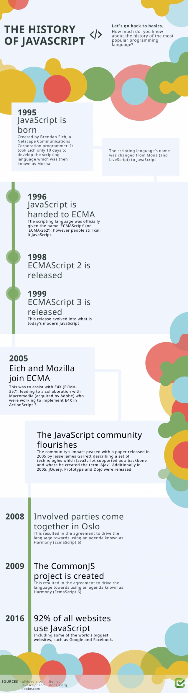

# About JS

JavaScript is a lightweight, **interpreted**, object-oriented language with [first-class function](https://en.wikipedia.org/wiki/First-class_function),
and is best known as the scripting language for Web Pages, but it's [used in many non-browser environments](https://en.wikipedia.org/wiki/ JavaScript#Uses_outside_Web_pages) as well. It is a [prototype-based](https://en.wikipedia.org/wiki/Prototype-based_programming), multi-paradigm scripting language that is dynamic, and support object-oriented, imperative, and functional program style.

JavaScript can function as both a procedural and an object oriented language. Objects are created programmatically in JavaScript, by attaching methods and properties to otherwise empty objects at run time. as opposed to the syntactic class definition common language like C++ and Java. Once an object has been constructed it can be used as blueprint(prototype) for creating similar objects.

## History

## Runtime platform

+ Web Browser: [V8 engine](https://v8.dev/)
+ Server: [NodeJS](https://nodejs.org/en/)

## Data types(Eight)

### Seven primitives

1. String: A sequence of characters that represent a text value. For example: "Hello".
2. Number: An integer or floating point number. For example: 45 or 3.14159.
3. Boolean: true and false. 
4. BigInt: An integer with arbitrary precision. For example: 9007199254740992n.
5. null: A special keyword denoting a null value. (Because JavaScript is case-sensitive, null is not the same as Null, NULL, or any other variant.).
6. undefined: A top-level property whose value is not defined.
7. Symbol (new in ECMAScript 2015). A data type whose instances are unique and immutable.

### One Customable
1. Object
    - Class
    - function

## Expression and Operations

### Assignment
+ =

### Addition(+)
+ (+)
+ +=
+ ++

### Subtraction(-)
+ (-)
+ -=
+ --

### Multiplication(*)
+ (*)
+ *=
+ **
+ **=

### Division(/)
+ /
+ /=

### Remainder(%)
+ %
+ %=

### Bitwise
+ & &=
+ | |=
+ ~ ~=
+ ^ ^=

### Shit
+ left: << <=
+ right: >> >=

### Logical
+ == ===
+ (> >=)
+ (< >=)
+ != !==
+ &&
+ ||
+ !
+ ??
+ ?:

### Others
+ async

