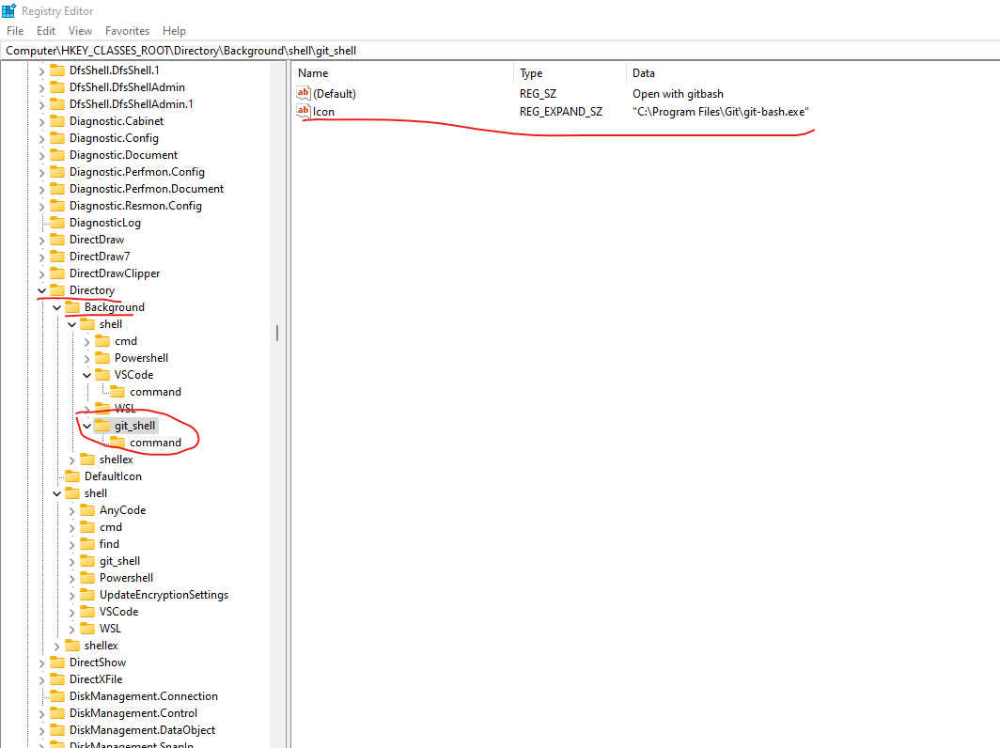

# help link

https://www.cnblogs.com/aurora-ql/p/14347519.html

# 通过注册表进行配置

将以下代码保存为[git].reg文件然后运行。

**注意git-bash本地安装路径**

```reg
Windows Registry Editor Version 5.00

[HKEY_CLASSES_ROOT\Directory\Background\shell\git_shell]
@="Open with gitbash"
"Icon"="C:\\Program Files\\Git\\git-bash.exe"

[HKEY_CLASSES_ROOT\Directory\Background\shell\git_shell\command]
@="\"C:\\Program Files\\Git\\git-bash.exe\""
```
