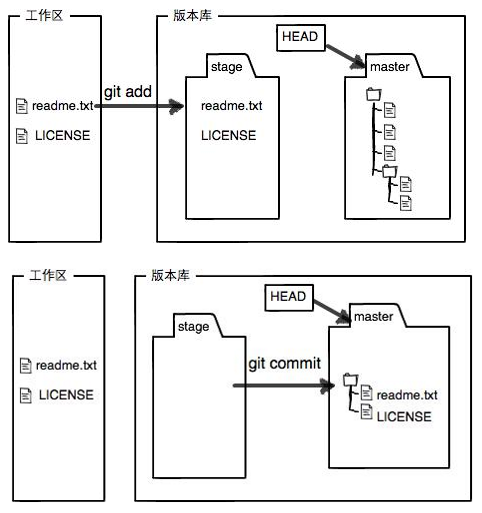

## Git教学网址

https://www.liaoxuefeng.com/wiki/896043488029600

# Git 工作区

# How to checkout a remote branch

1. git fetch <remote> <branch name>
2. git checkout <remote branch name>

# How do I create a local branch from a remote branch?

1. git fetch <remote> <branch name> 
2. git checkout -b myLocalName origin/remoteName 

# Rest commit id of branch
1. Local: git rest commitid
2. Remote:  
    - git rest commitid
    - git push -f origin branch